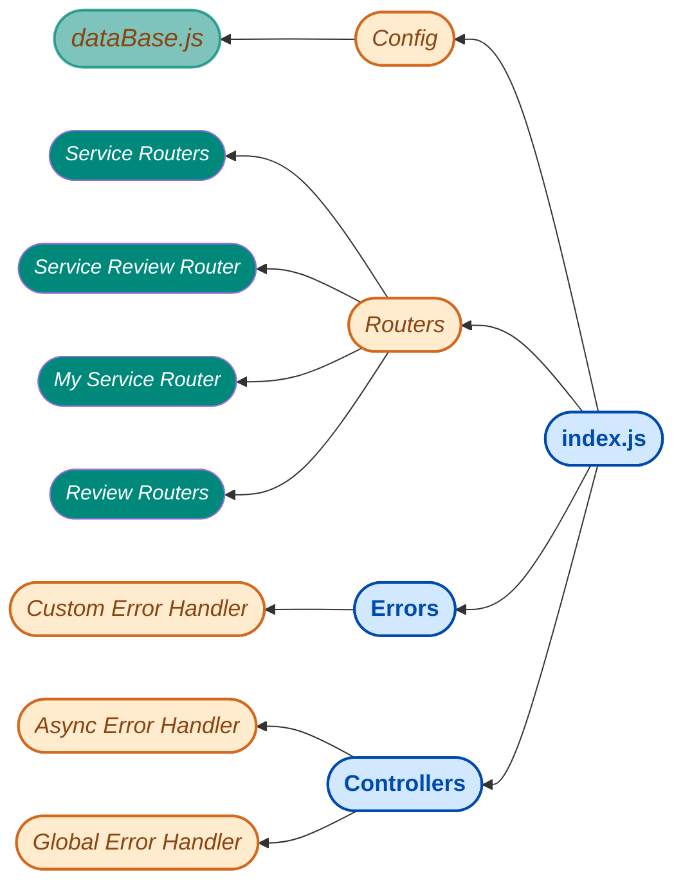

<a>
<h1 align="center">Routers and Handlers</h1>
</a>

***
[_Server Repo_](https://github.com/Dev-NayanBiswas/Assignment-11-Server)
 
[_Feel Free to Visit **FaiRate**_](https://assignment-11-fairate.netlify.app/)

 
 
 
 

    <a>
    <h4><i></i></h4>
    </a>
    

 
 
 
 
 

### *Thanks for Visiting*
### <a>*FaiRate*</a>

***Learning to write programs stretches your mind, and helps you think better, creates a way of thinking about things that I think is helpful in all domains.***

<a> ― *Bill Gates*</a> 